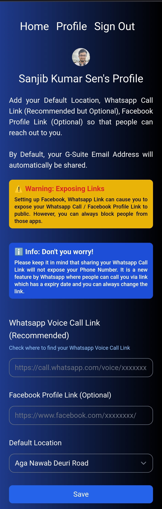
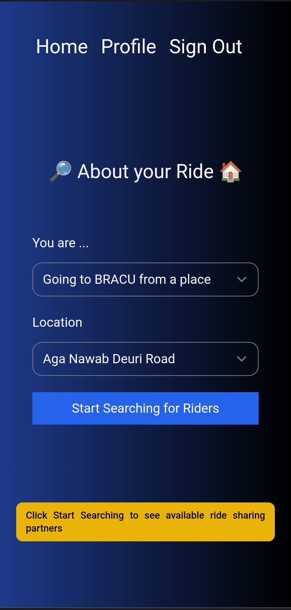
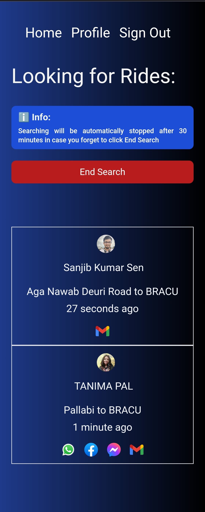

# Ride with BRACU

Ride with BRACU is a Ride Sharing app only for BRAC University Students which focuses on cost, convenience and safety. It is not a direct competitor of traditional ride sharing apps such as Uber, Lyft, Pathao, Obhai, etc. rather an extension to make the ride sharing process of those apps cheaper and safer.

## Explaination
Suppose you are a BRAC Univsersity Student and you live in Shyamoli, Dhaka. You are late for your University and you want to use a Ride Sharing app like Uber. But the cost is too much. So, you thought:

> I wish I knew someone from Shyamoli so that I could share my Uber Ride with him/her.

This app will help you to find every students of BRACU from Dhaka City who are also looking for a Ride and connect with them. In that way, you can communicate with your university mate, share your ride and split the fare. Which means:

- \+ Safety
- \- Money

## Screenshots (Android)

<p float="left" align="middle">
  
   
   
   

</p>


   

For Desktop Screenshots Please visit [Desktop Screenshots](/screenshots/desktop/README.md)

## Features:
- Strict Sign in with BRACU G-Suite Email
- Ability to save Whatsapp Voice Call Link, Facebook Link, Messenger Link for better communication
- Ability to save default location for faster user experience
- Responsive UI (Desktop, Mobile and Tablet)
- Can be used as a Web-app
- Ability to see users who are looking for partners
- Searching state will automatically be turned off in case of 30 minutes of inactivity
- Can be easily converted to React Native / Expo and use as a native Android / iOS app
- Unit Tests
## How to Build 

- Copy `.env.example` as `.env`
- In the `.env` file enter your [Google Cloud credentials](https://console.cloud.google.com/apis/credentials)
- In the `prisma/schema.prisma` comment line no 10, 11 and uncomment line no 14, 15 (Hint is given in the file).
- Run the following commands
    ```bash
    npm install &&
    npx prisma migrate dev &&
    npx prisma db push &&
    npm run dev
    ```
Then open [http://localhost:3000](http://localhost:3000) with a browser to see the result.

## Tech Stacks
- [NextJS](https://nextjs.org/) (Version 13.0.6 with [app directory](https://beta.nextjs.org/docs/routing/fundamentals#the-app-directory) enabled)
- [TailwindCSS](https://tailwindcss.com/) for Custom CSS Styling
- [SWR](https://swr.vercel.app/) for fetching
- [Prisma](https://www.prisma.io/) for DB Migration
- [PostgreSQL](https://www.postgresql.org/) as Backend DB
- [NextAuth](https://next-auth.js.org/) for Authentication (Mainly Google Auth)
- [TypeScript](https://www.typescriptlang.org/) for Type Safety
- [ReactJS](https://reactjs.org/) as JavaScript Library
- [Vercel](https://vercel.com/) for frontend deployment
- [Railway](https://railway.app/) for backend deployment
- [Eslint](https://eslint.org/) for linting
- [Prettier](https://prettier.io/) as a code formatter
- [Playwright](https://playwright.dev/) for end-to-end unit tests
## Notable Achievement

Before sending the data to the DB, I have used sessionStorage as a middleware for fecthing and sending data (cache). This reduces the need of using frequent DB queries as well as improved the performance by 10x.

## Future Roadmap
- Google Map integration for showing location and roads
- GPS integration for grabbing current location
- Convert to React Native after final build
- Better UI/UX
- You tell me

## Contact
Please mail to [sksenonline@gmail.com](mailto:sksenonline@gmail.com)